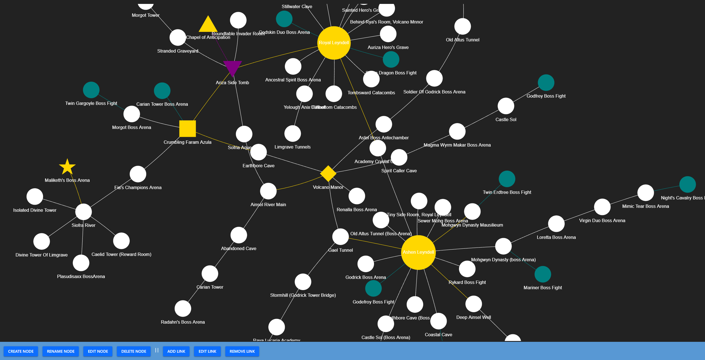

# EXP Network Visualiser

A simple standalone network graph visualiser created with Python.

Not designed for physical computer networks. This was originally designed for tracking locations in Elden Ring Foggate Randomiser runs.

### Libraries used:
- [PyVis](https://pyvis.readthedocs.io/en/latest/index.html)
- [NiceGUI](https://nicegui.io/)
- [pywebview](https://pywebview.flowrl.com/)
- [jsonpickle](https://pypi.org/project/jsonpickle/)

### License
This project is licensed under the MIT license.